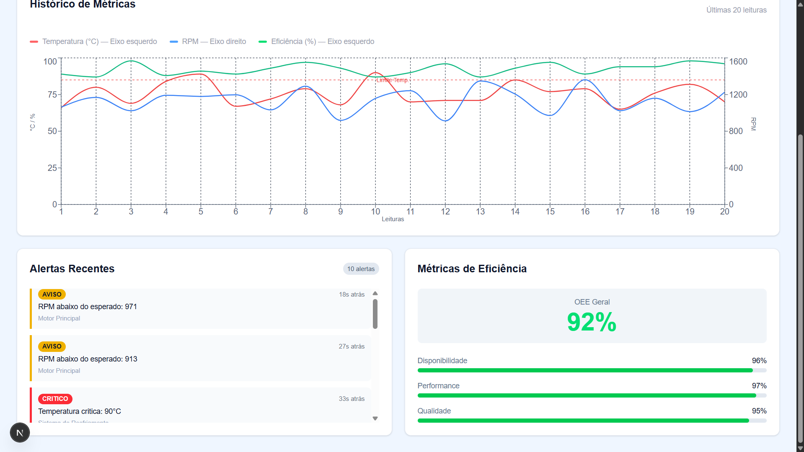
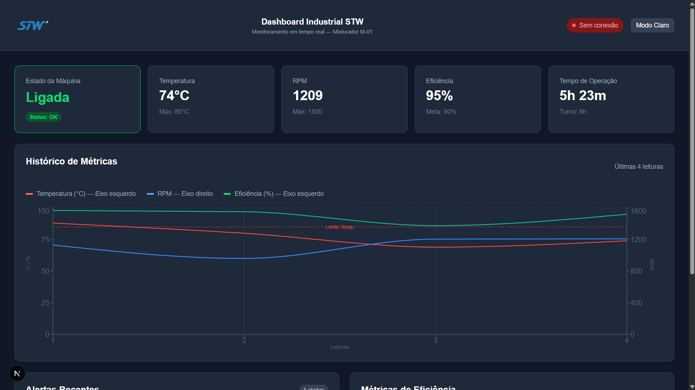
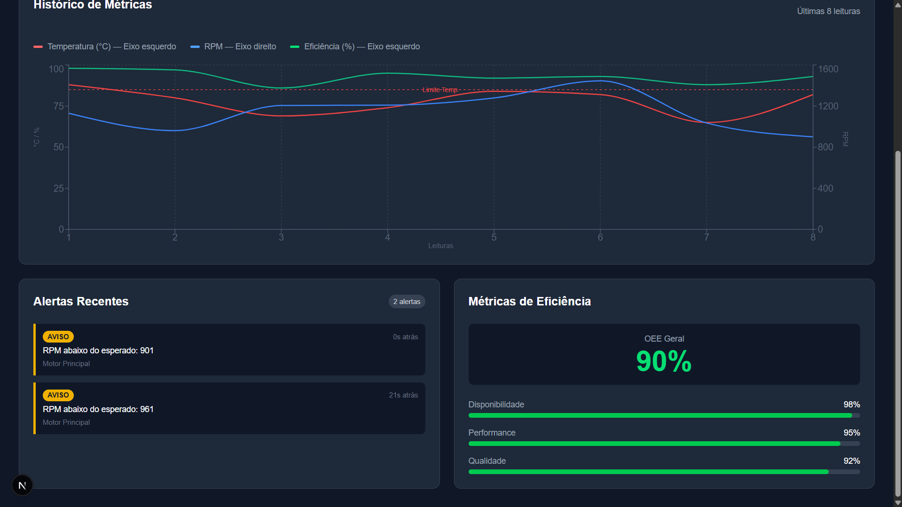

# Dashboard Industrial STW

Dashboard de monitoramento industrial em tempo real, desenvolvido como desafio técnico para a vaga de desenvolvedor na STW.


---

## Sobre o Projeto

Desenvolvi esse dashboard para monitorar uma máquina industrial (Misturador M-01) em tempo real. O sistema mostra o estado da máquina, métricas como temperatura e RPM, gera alertas automáticos quando os valores saem do normal e exibe métricas de eficiência OEE.

---

## Tecnologias Utilizadas

- **Next.js 15** — Framework que usei para construir a aplicação React
- **TypeScript** — Versão do JavaScript com tipagem, obrigatório no desafio
- **Tailwind CSS** — Biblioteca de estilos que usei para estilizar tudo sem escrever CSS manual
- **Recharts** — Biblioteca de gráficos para React
- **Web Audio API** — API nativa do navegador para gerar sons de alerta

---

## Funcionalidades

### Monitoramento em Tempo Real
- Atualização automática a cada 3 segundos
- Card de estado da máquina (Ligada, Desligada, Manutenção, Erro)
- Cards de métricas com indicadores de tendência (Temperatura, RPM, Eficiência, Tempo de Operação)
- Tempo de operação crescente em tempo real
- Simulação de perda de conexão com indicador visual no header

### Visualização de Dados
- Gráfico de histórico com dois eixos Y (temperatura/eficiência e RPM)
- Tooltip com data e hora exata de cada leitura
- Linha de referência do limite máximo de temperatura
- Animações suaves nos cards a cada atualização

### Sistema de Alertas
- 3 níveis de severidade: INFO, AVISO e CRÍTICO
- Alerta sonoro via Web Audio API para alertas críticos
- Tempo decorrido desde cada alerta
- Histórico persistente com LocalStorage — alertas não somem ao recarregar
- Botão para limpar histórico de alertas

### Métricas de Eficiência (OEE)
- OEE Geral em destaque
- Disponibilidade, Performance e Qualidade com barras de progresso coloridas
- Verde ≥ 90%, Amarelo ≥ 75%, Vermelho abaixo de 75%

### Interface
- Modo escuro e modo claro
- Design responsivo
- Acessibilidade com `aria-label` e `role` nos elementos interativos

---

## Estrutura do Projeto
```
src/
└── app/
    ├── components/
    │   ├── CardEstadoMaquina.tsx  # Card de estado da máquina
    │   ├── MetricCard.tsx         # Card reutilizável de métricas com animação
    │   ├── GraficoHistorico.tsx   # Gráfico de histórico com Recharts
    │   ├── Header.tsx             # Cabeçalho com logo, status e tema
    │   ├── MetricasEficiencia.tsx # Painel OEE com barras de progresso
    │   └── PainelAlertas.tsx      # Lista de alertas em tempo real
    ├── lib/
    │   └── simulator.ts           # Simulador de dados da máquina
    ├── types/
    │   └── index.ts               # Interfaces TypeScript
    └── page.tsx                   # Página principal
```

---

## Como Executar

### Pré-requisitos

- Node.js 18 ou superior
- npm

### Instalação
```bash
# Clone o repositório
git clone https://github.com/gabriell-franca/dashboard-industrial.git

# Entre na pasta
cd dashboard-industrial

# Instale as dependências
npm install
```

### Executando em desenvolvimento
```bash
npm run dev
```

Acesse **http://localhost:3000** no navegador.

### Build de produção
```bash
npm run build
npm start
```

---

## Arquitetura do Sistema

### Frontend
Usei o **Next.js 15** com App Router por ser o framework recomendado para projetos React hoje em dia. Os componentes do dashboard precisam do `"use client"` porque atualizam a tela em tempo real — sem isso, o Next.js tentaria renderizar tudo no servidor e os dados não atualizariam.

### Backend Simulado
Como ainda estou aprendendo sobre bancos de dados e APIs, optei por criar um simulador em TypeScript (`src/app/lib/simulator.ts`) que gera os dados da máquina automaticamente a cada atualização. Ele funciona como se fosse um backend simples, gerando valores dentro de faixas realistas de operação industrial:


| Métrica | Faixa Normal | Quando gera alerta |
|---------|-------------|-----------------|
| Temperatura | 65°C – 95°C | Acima de 88°C → CRÍTICO |
| RPM | 900 – 1500 | Abaixo de 1000 → AVISO |
| Eficiência | 85% – 98% | — |
| OEE | 88% – 96% | — |

Se fosse um projeto real, esse simulador seria substituído por uma conexão com sensores ou uma API.

---

## Decisões Técnicas

### Por que Next.js?
Foi o framework que aprendi durante o desenvolvimento do projeto. Ele já vem configurado com TypeScript e Tailwind, o que facilitou muito o início.

### Por que simulador em vez de SQLite?
Tentei configurar o SQLite mas percebi que precisaria de um servidor backend separado, o que aumentaria muito a complexidade. Com o simulador, qualquer pessoa consegue rodar o projeto com apenas `npm install` e `npm run dev`, sem precisar configurar nada extra.

### Por que dois eixos Y no gráfico?
Percebi que temperatura e eficiência ficam entre 0 e 100, mas o RPM chega até 1600. Com um único eixo, as linhas de temperatura e eficiência ficavam todas espremidas na parte de baixo e não dava pra ler nada. Separar em dois eixos resolveu o problema.

### Por que Web Audio API para alertas sonoros?
Pesquisando sobre como gerar sons no navegador, encontrei a Web Audio API que já vem nativa — sem precisar instalar nenhuma biblioteca. Gera um bipe curto quando o alerta é crítico.

### Por que LocalStorage para persistência?
Queria que os alertas não sumissem ao recarregar a página. O LocalStorage foi a solução mais simples que encontrei para isso, salvando os dados direto no navegador.

### Por que a animação de "placar" nos cards?
Queria deixar claro visualmente quando um valor muda. Testei algumas opções e achei que o efeito de slide — onde o número antigo sai por cima e o novo entra por baixo — ficou mais elegante do que só piscar.

---

## Dados de Teste

Os dados são gerados automaticamente pelo simulador ao rodar o projeto. Caso queira testar cenários específicos, é possível editar os valores em `src/app/lib/simulator.ts`:
```ts
// Para forçar temperatura crítica e ver o alerta CRÍTICO (acima de 88°C):
const temperatura = aleatorio(89, 95)

// Para forçar RPM baixo e ver o alerta AVISO (abaixo de 1000):
const rpm = aleatorio(900, 999)

// Para voltar ao comportamento normal:
const temperatura = aleatorio(65, 88)
const rpm = aleatorio(1000, 1500)
```

---

## Screenshots responsividade


## Screenshots gerais





---

## Autor

**Gabriel de França** — Desenvolvido como desafio técnico para STW