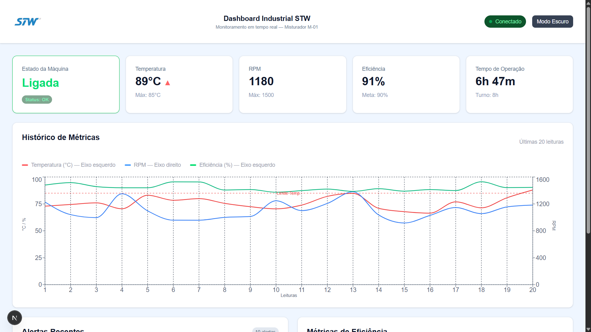

# Dashboard Industrial STW

Dashboard de monitoramento industrial em tempo real, desenvolvido como desafio técnico para a vaga de desenvolvedor na STW.




---

## Sobre o Projeto

Sistema de monitoramento de uma máquina industrial (Misturador M-01) com atualização de dados em tempo real, sistema de alertas, métricas de eficiência OEE e suporte a modo escuro/claro.

---

## Tecnologias Utilizadas

- **Next.js 15** — Framework React com App Router
- **TypeScript** — Tipagem estática obrigatória
- **Tailwind CSS** — Estilização utilitária
- **Recharts** — Biblioteca de gráficos
- **Web Audio API** — Alertas sonoros nativos do navegador

---

## Funcionalidades

- Monitoramento em tempo real (atualização a cada 3 segundos)
- Card de estado da máquina (Ligada, Desligada, Manutenção, Erro)
- Cards de métricas com indicadores de tendência (Temperatura, RPM, Eficiência, Tempo de Operação)
- Gráfico de histórico com dois eixos (temperatura/eficiência e RPM)
- Sistema de alertas com 3 níveis: INFO, AVISO e CRÍTICO
- Alerta sonoro para alertas críticos via Web Audio API
- Métricas de eficiência OEE com barras de progresso
- Simulação de perda de conexão
- Modo escuro e modo claro
- Tempo de operação crescente em tempo real

---

## Estrutura do Projeto
```
src/
└── app/
    ├── components/
    │   ├── CardEstadoMaquina.tsx  # Card de estado da máquina
    │   ├── CardMetrica.tsx        # Card reutilizável de métricas
    │   ├── GraficoHistorico.tsx   # Gráfico de histórico com Recharts
    │   ├── Header.tsx             # Cabeçalho com logo e status
    │   ├── MetricasEficiencia.tsx # Painel OEE
    │   └── PainelAlertas.tsx      # Lista de alertas em tempo real
    ├── lib/
    │   └── simulator.ts           # Simulador de dados da máquina
    ├── types/
    │   └── index.ts               # Interfaces TypeScript
    └── page.tsx                   # Página principal
```

---

## Como Executar

### Pré-requisitos

- Node.js 18 ou superior
- npm

### Instalação
```bash
# Clone o repositório
git clone https://github.com/gabriell-franca/dashboard-industrial.git

# Entre na pasta
cd dashboard-industrial

# Instale as dependências
npm install
```

### Executando em desenvolvimento
```bash
npm run dev
```

Acesse **http://localhost:3000** no navegador.

### Build de produção
```bash
npm run build
npm start
```

---

## Decisões Técnicas

### Simulação de dados
Optei por um simulador em TypeScript (`simulator.ts`) em vez de SQLite para simplificar a execução do projeto — sem necessidade de configurar banco de dados. Os dados são gerados aleatoriamente dentro de faixas realistas de operação industrial.

### Tempo real sem WebSocket
A atualização em tempo real é feita com `setInterval` a cada 3 segundos via `useEffect`. Para produção, o ideal seria substituir por WebSocket ou Server-Sent Events conectado a um backend real.

### Dois eixos no gráfico
O gráfico usa dois eixos Y para que temperatura/eficiência (0–100) e RPM (0–1600) sejam lidos com precisão sem distorção de escala.

### Web Audio API para alertas sonoros
Usado a API nativa do navegador para gerar o bipe de alerta crítico, sem necessidade de instalar bibliotecas externas de áudio.

### Componentização
Cada seção do dashboard é um componente independente com suas próprias props tipadas, facilitando manutenção e reutilização.

---

## Screenshots
!(./docs/preview.png)
!(./docs/preview2.png)
!(./docs/previewdark.png)
!(./docs/previewdark2.png)


---

## Autor

**Gabriel** — Desenvolvido como desafio técnico para STW